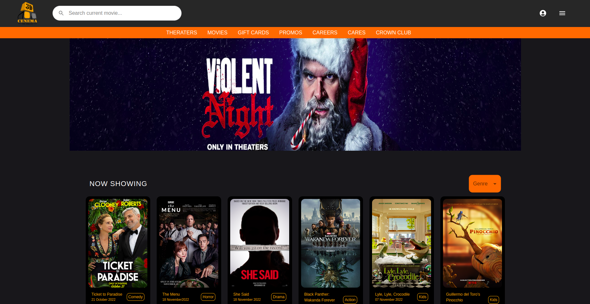
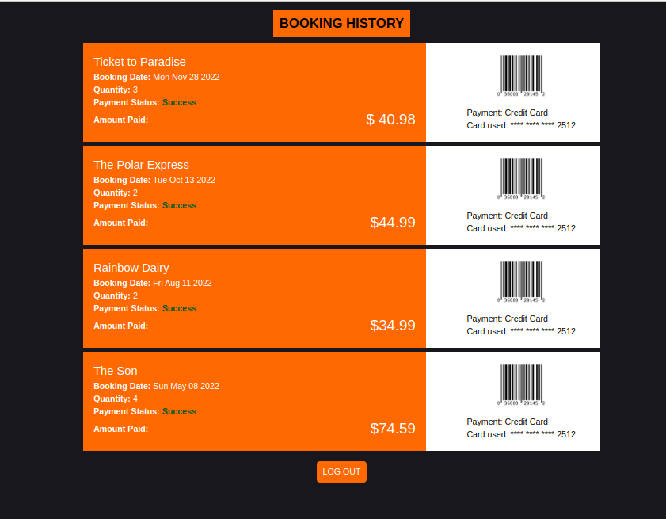
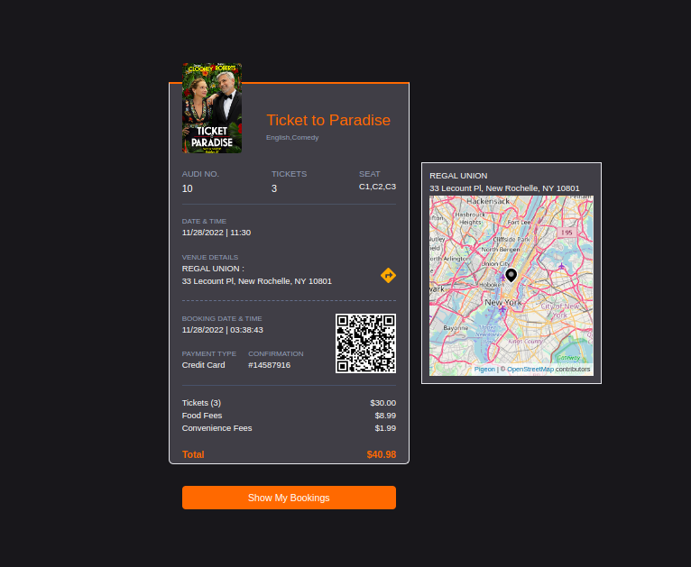
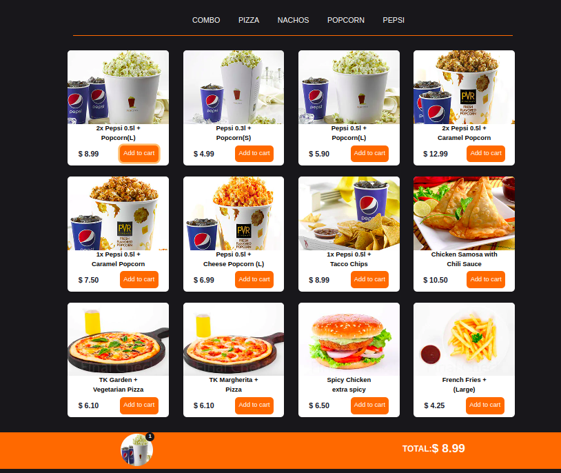

# Movie Booking

## Link

- Live Site URL: [https://harshita1225.github.io/movie-booking/](https://harshita1225.github.io/movie-booking/)

## Table of contents

- [Overview](#overview)

- [Link](#link)

- [The challenge](#the-challenge)

- [Screenshot](#screenshot)

- [My process](#my-process)

- [Built with](#built-with)

## Overview

### Project Specifications

- Create a movie booking website with login functionality

- Movie info diaplays movie details and movie booking page is for selecting time and date

- select seat and also show terms and conditions page

- lastly show confirmation page with all entered information and add this info to booking history page

### Screenshot

#### Desktop Version

- HomePage
  

- Booking History
  

- Confirmation Page
  
- offers Page
  

## My process

- Home Page
- Login Page
- Movie Info Page
- Seat Selection Page
- Date Time Selection Page
- Booking History
  -Food Offers Page
- Confirmation Page

### Built with

- Semantic HTML5 markup
- Tailwind
- React js
- CSS
